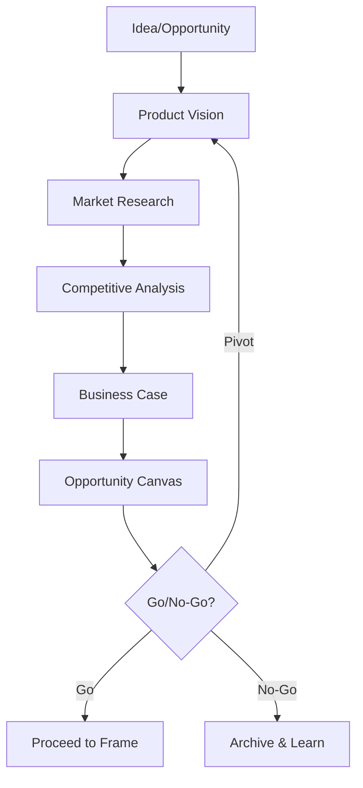

# Phase 00: Discover

Validate ideas and opportunities before committing to Frame.

## Purpose

The Discover phase is a **pre-commitment checkpoint** where ideas are evaluated for viability, market fit, and strategic alignment. This phase prevents wasted effort by validating opportunities before investing in detailed requirements.

## When to Use Discover

- New product ideas requiring validation
- Market opportunities needing assessment
- Strategic initiatives before resource commitment
- Feature proposals with uncertain business value

## Key Principle

**Validate Before You Invest**: Discover ensures alignment on the opportunity before committing engineering and design resources to Frame.

## Input Gates

Prerequisites to enter this phase:
- **Idea or opportunity identified**: A potential solution, market gap, or user need
- **Sponsor commitment**: Someone willing to champion the investigation

## Exit Gates

Criteria to proceed to Frame (defined in `GATE.yaml`):
- **Product vision approved**: Clear mission and 3-5 year direction
- **Business case validated**: ROI justifies investment
- **Competitive position defined**: Differentiation strategy established
- **Opportunity canvas complete**: Problem-solution fit confirmed

## Artifacts

| Artifact | Purpose | Output Location |
|----------|---------|-----------------|
| Product Vision | Mission, direction, value props | `docs/helix/00-discover/product-vision.md` |
| Business Case | Investment justification | `docs/helix/00-discover/business-case.md` |
| Competitive Analysis | Market positioning | `docs/helix/00-discover/competitive-analysis.md` |
| Opportunity Canvas | Problem-solution fit | `docs/helix/00-discover/opportunity-canvas.md` |

## Process Flow

## Human vs AI Responsibilities

### Human Responsibilities
- **Vision setting**: Define mission and strategic direction
- **Market judgment**: Assess competitive positioning
- **Investment decisions**: Approve business case
- **Go/No-Go**: Final decision on proceeding

### AI Responsibilities
- **Research support**: Gather market data and competitor info
- **Analysis**: Structure business case calculations
- **Documentation**: Draft and refine artifacts
- **Gap identification**: Surface missing considerations

## Success Criteria

Discover is complete when:
1. **Vision clarity**: Team can articulate the opportunity in one sentence
2. **Business justification**: ROI and strategic value are quantified
3. **Market understanding**: Competitive landscape is mapped
4. **Problem validation**: Customer pain points are confirmed
5. **Decision made**: Clear go/pivot/no-go with rationale

## Next Phase: Frame

Once Discover validates the opportunity, proceed to Frame where you will:
- Define detailed requirements (PRD)
- Create user personas and stories
- Establish success metrics
- Document risks and constraints

---

*Discover prevents building the wrong thing. Frame prevents building it wrong.*
